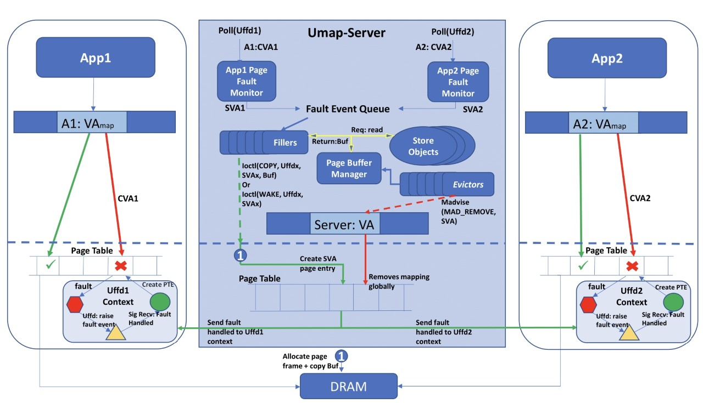

.. _design:

===========================
MP-UMap Page Fault Handling
===========================

This page provides design details on MP-UMap.
For this description, we call an application that uses mpumapd library to instantiate a MP-UMap service as a UMap-Server. 
The Applications App1 and App2 use mpumapclient library to communicate and interface with UMap-Server. 
In contrast to UMap, as shown in Figure, UMap-Server runs independently of the application and it launches one fault 
monitor thread per client application. Absence of a valid page table entry, causes application thread to switch to 
kernel mode and it creates a uffd_msg holding page fault information before blocking itself. The fault monitor polling 
on UFFD_fd file handler receives the faulting address Client Virtual Address (CVA) as part of the message. In the 
figure, we illustrate a scenario where two applications App1 and App2 page fault on addresses A1:CVA1 and A2:CVA2, 
respectively. Corresponding fault monitoring threads translate these application addresses to server's address space 
as Server Virtual Address (SVA) SVA1 and SVA2. These addresses are then placed on a fault event queue to a group of 
worker threads called filler threads (FTs). The job of a filler in UMap-server, is to perform the following:

* Read the appropriate page from the Store Objects
* Update status of the page in Page Buffer Manager
* Issue Ioctls on target Uffd_fd to copy the contents of the read buffer into the faulting page
* Signal the blocked application about completion of the faults handling

Additionally, the fillers need to handle the case when SVA1 and SVA2 are the same. This scenario is different 
from contending requests arising from different threads of a single process. There, the UMap-server receives 
the page faults on the same fault monitor, which allows these requests to be grouped together. Also, a single 
UFFDIO_IOCOPY is capable of unblocking any number of threads of a process blocked on a single memory region. 
In case of requests arriving from multiple clients, the Page Buffer Manager, which is responsible for maintaining 
a record of all mapped regions, informs fillers of a region's current state. In case the memory region is in an 
actively filling state, the contending requests wait for the region's state to change. On completion of the initial 
request, the UFFD_IOCOPY ioctl is issued for the original requestor, while for all other blocked processes a 
UFFDIO_WAKE ioctl is issued. A UFFDIO_COPY allocates pages for the SVA region, copies the contents of a buffer 
and unblocks associated context. UFFDIO_WAKE only unblocks a target context. The unblocked context assigns CVAs 
to physical page frames thereby handling the page fault. Another key aspect of Page buffer management is to limit 
the size of the page buffer while retaining useful pages. This is accomplished by Evictor Threads (ETs) that 
operate on the same eviction policies of UMap. It is to be noted that the use of memfd to create a shared region, 
creates a volatile backing store in memory. This means that madvice of MADV_DONTNEED may mark pages ready to be 
removed but due to memory based backing store, the kernel still retains pages in memory. To resolve this, ETs 
issue MADV_REMOVE as shown in the Figure. During our testing, it was observed that having a fixed sized Page 
cache buffer potentially adds pressure on system memory, which in turn prevents the UMap-server from scaling 
the number of concurrent processes it can support. This drawback was eliminated through the adaptive page cache 
size management optimization previously incorporated into UMap and ported to MP-UMap.
